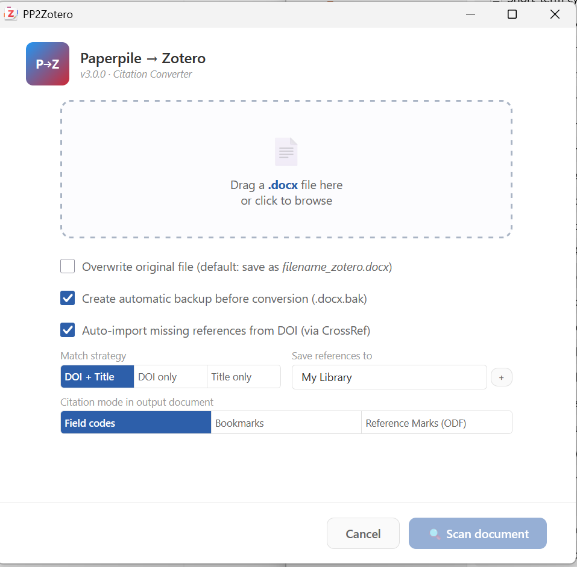

# Paperpile to Zotero

Paperpile to Zotero converts live Paperpile citations in Word documents into editable Zotero citations and rebuilds the bibliography.



## What it does

- Reads the CSL metadata stored in Paperpile citation fields.
- Matches references against your Zotero library by DOI and normalized title.
- Can retrieve missing items by DOI through Crossref.
- Rebuilds citations and the bibliography in Zotero format.
- Preserves the source manuscript and creates a separate converted file.
- Can create an additional safety backup before conversion.

## Using the converter

1. Open the converter from Zotero's **Tools** menu.
2. Select the Paperpile `.docx` manuscript.
3. Review the matched, imported, and missing references.
4. Convert the document.
5. Open the new file and run Zotero **Refresh**.

## Installation

1. Download the latest `.xpi` from [Releases](https://github.com/sorinhostiuc/pp2zotero/releases/latest).
2. In Zotero, open **Tools > Plugins**.
3. Choose **Install Plugin From File**, select the `.xpi`, and restart Zotero if asked.

The plugin supports Zotero 7 through 9.

## Development

```bash
npm ci
npm test
npm run build
```

## License

[MIT](LICENSE)
